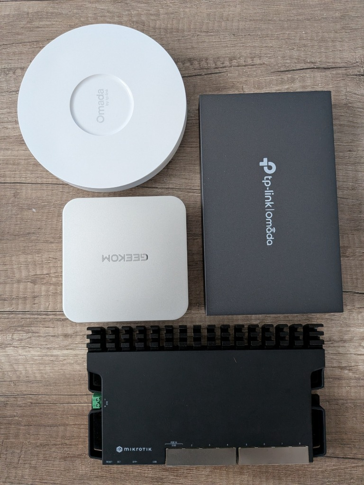
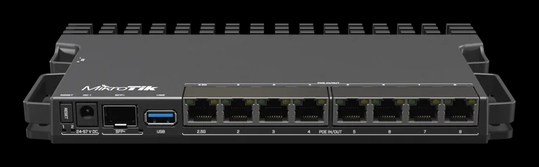
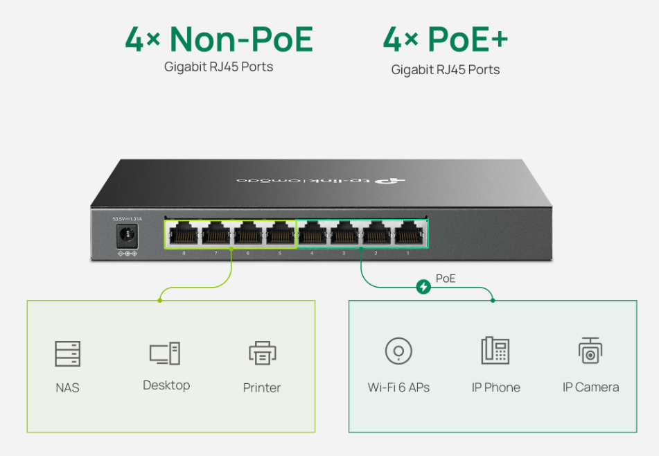
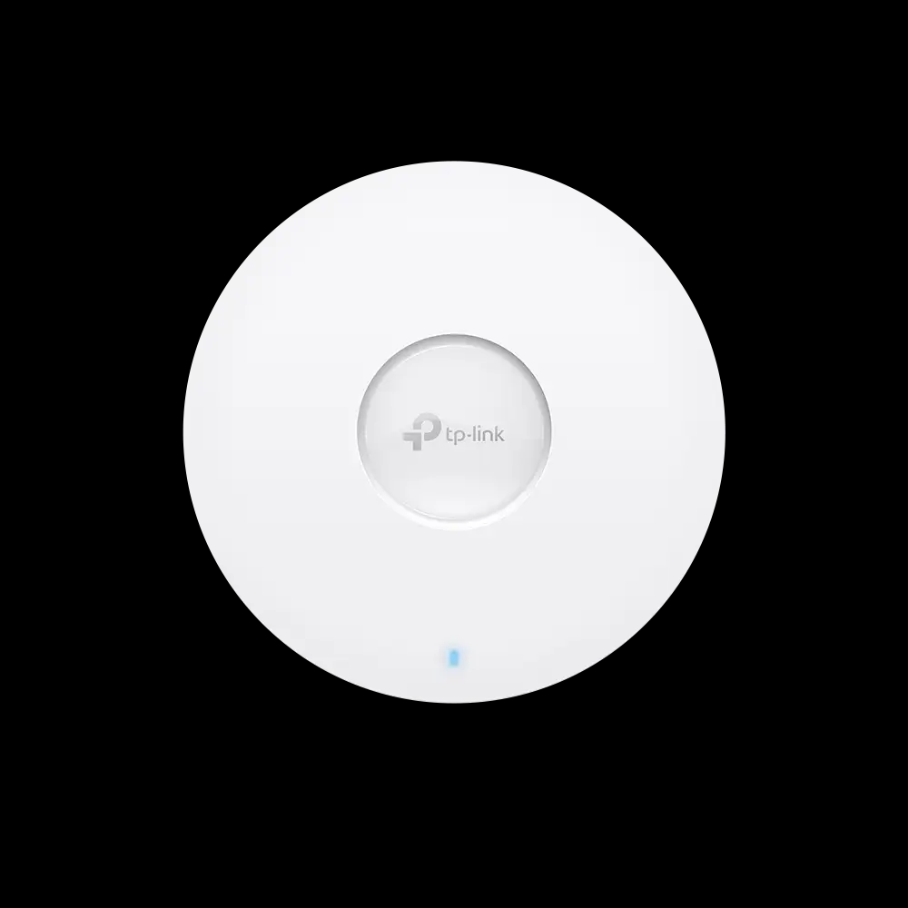

# 🏠 Personal Home Lab — System Architecture

Dies ist meine persönliche Home-Lab-Umgebung, die aus purer Leidenschaft für IT-Infrastruktur und Systemtechnik entstanden ist. Parallel zu meiner Ausbildung zum Fachinformatiker für Systemintegration (FISI) habe ich diese Enterprise-Simulation aufgebaut, um echte, praktische Erfahrungen (Hands-on) mit Virtualisierung, Netzwerktechnik und IT-Sicherheit zu sammeln, die über die Theorie hinausgehen.

## 🎯 Projektziel

Das primäre Ziel dieses Repositories ist die Simulation einer vollständigen, sicheren und segmentierten Unternehmensumgebung. Alle Entscheidungen basieren auf Enterprise Best Practices, einschließlich Netzwerktrennung (VLANs), Storage-Tiering, deutscher Berechtigungsstandards (IGDLA) und sicheren Remote-Zugriffsstrategien.

## 🏗️ Hardware & Virtualisierung

- **Hypervisor:** Geekom A8 Mini PC (AMD Ryzen 8000 Series, Proxmox VE, 32GB DDR5 RAM, Radeon 780M iGPU)
- **Netzwerk-Hardware:** 
  - MikroTik RB5009UG+S+IN (Router / Firewall / Inter-VLAN Routing)
  - TP-Link SG2008P (L2+ Managed PoE+ Switch)
  - TP-Link EAP610 (Wi-Fi 6 Access Point mit Multi-SSID)

### 📷 Hardware Setup Galerie

  <table border="0">
    <tr>
      <td align="center" colspan="3" style="padding: 10px;">
         
        <b>📷 Real-World Hardware Setup:</b> MikroTik RB5009, Geekom A8 (Proxmox Node), TP-Link Omada Switch & EAP610 AP
      </td>
    </tr>
    <tr>
      <td align="center" width="33%" style="padding: 10px;">
         
        <b>MikroTik RB5009UG+S+IN</b> Core Router & Inter-VLAN Firewall
      </td>
      <td align="center" width="33%" style="padding: 10px;">
         
        <b>TP-Link SG2008P</b> L2+ Managed PoE+ Switch
      </td>
      <td align="center" width="33%" style="padding: 10px;">
         
        <b>TP-Link EAP610</b> Wi-Fi 6 Access Point
      </td>
    </tr>
  </table>

### 💾 Storage-Strategie (3-Tiering)
Um die Leistung zu optimieren und Ressourcen effizient zu nutzen, ist der Speicher in drei Schichten unterteilt:
- **Tier 1 (Hot - `local-lvm`):** 1 TB NVMe M.2 SSD (Für Proxmox OS und aktive VM/LXC Root-Disks)
- **Tier 2 (Warm - `usb-ssd`):** 1 TB NVMe über 10 Gbps USB-C (Für VM-Backups, Docker-Volumes, große VM-Disks)
- **Tier 3 (Cold - `sd-storage`):** 128 GB MicroSD (A2/V30) (Für Log-Archive, ISO-Dateien, Templates, Test-Disks)

## 🕸️ Netzwerk & VLAN Design

Die Umgebung läuft hinter einem **Double NAT**, weshalb keine klassischen Portfreigaben (Port Forwarding) möglich sind. Alle Dienste sind durch strikte VLAN-ACLs isoliert:

| VLAN | Name | Subnet | Tag | Verwendungszweck |
|---|---|---|---|---|
| **10** | Mgmt | `10.0.10.0/24` | Mgmt | Management-Netzwerk (Proxmox, Router, Switche, Pi-hole) |
| **21** | WinServer | `10.0.21.0/24` | WinS | Active Directory & Windows Server Lab |
| **22** | LinuxLab | `10.0.22.0/24` | LinS | Linux VMs/LXCs, Docker, AI Gateway & Proxy Dienste |
| **30** | Haus | `10.0.30.0/24` | HLab | Haupt-Heimnetzwerk (Können auf AI Gateway zugreifen) |
| **40** | IoT | `10.0.40.0/24` | IoT | Isolierte Smart-Home & IoT-Geräte |
| **60** | Printer | `10.0.60.0/24` | Printer | Netzwerkdrucker |
| **99** | Kali | `10.0.99.0/24` | KLan | Penetration Testing & Sicherheits-Lab |

## 🧠 Architektur-Entscheidungen & Best Practices

- **LXC vs. Docker (Hybrid-Ansatz):** Infrastrukturdienste (z.B. Tailscale, Pi-hole) laufen als Standalone LXC für maximale Ausfallsicherheit. Applikationsdienste (NPM, OmniRoute) laufen in Docker innerhalb eines LXC.
- **Tailscale Remote-Zugang:** Der VPN-Zugang ist in einem isolierten LXC installiert. Fällt ein anderes Subsystem aus, bleibt der administrative Fernzugriff auf das Heimnetz unberührt.
- **Windows Server IGDLA-Prinzip:** Im Windows Server Lab (VLAN 21) werden Zugriffsberechtigungen nach dem deutschen FISI-Standard **IGDLA** (Identities, Global groups, Domain Local groups, Access) vergeben.
- **Local AI & GPU-Passthrough:** Das lokale Sprachmodell (Qwen 2.5 7B) läuft in einem unprivilegierten LXC mit Hardware-Beschleunigung über AMD Radeon 780M iGPU (`/dev/dri`).
- **Portfolio AI Integration:** Integration von Local AI mit **Cloudflare Tunnel & Turnstile** — ermöglicht kostenlose, sichere KI-Chatbot-Antworten auf meiner Website, ohne Ports im Modem zu öffnen.
- **DNS-Standard:** Die Umgebung verwendet **`.mylab`** als lokale Top-Level-Domain (TLD).

## 🗺️ Roadmap & Geplante Services

Dieses Ökosystem wird kontinuierlich erweitert. Status der Infrastruktur-Dienste:

- [x] **Proxmox Hypervisor & Storage Tiering** (Abgeschlossen)
- [x] **Windows Server 2025 DC & Windows 11 Client** (Abgeschlossen, VLAN 21)
- [ ] **Pi-hole (DNS & Adblocking)** (Geplant - Schritt 1)
- [ ] **Nginx Proxy Manager (Reverse Proxy & SSL)** (Geplant - Schritt 2)
- [ ] **Tailscale Subnet Router (Zero-Trust VPN)** (Geplant - Schritt 3)
- [ ] **OmniRoute AI Gateway (Groq / NVIDIA NIM / Local LLM)** (Geplant - Schritt 4)
- [ ] **Uptime Kuma & Status Badges** (Geplant)
- [ ] **Vaultwarden & Automated Encrypted Backup** (Geplant)
- [ ] **Kali Linux Pentesting Lab** (Geplant, VLAN 99)

---
*Dieser Bereich wird automatisch aktualisiert, sobald neue Module implementiert werden.*
