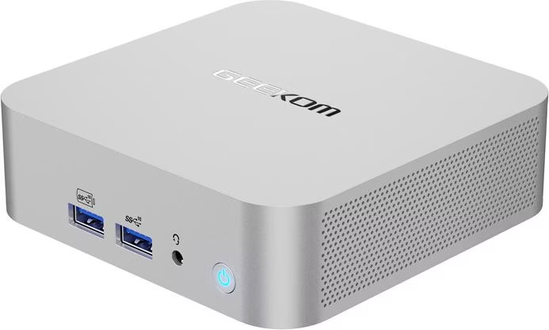
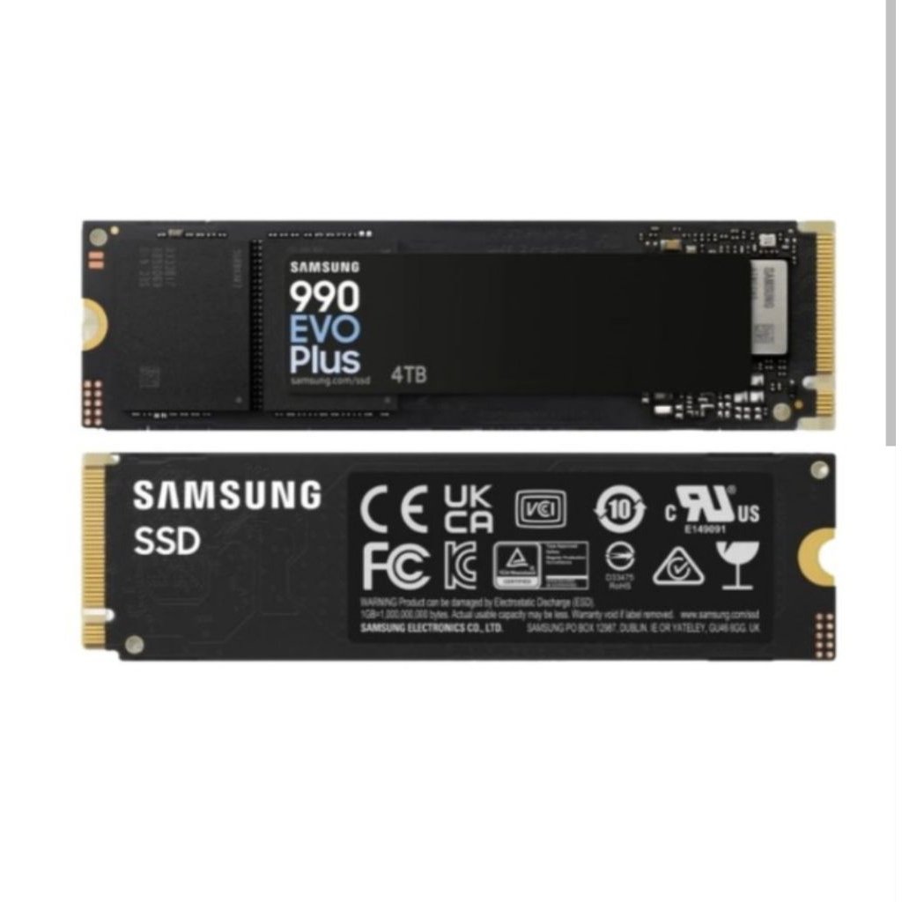
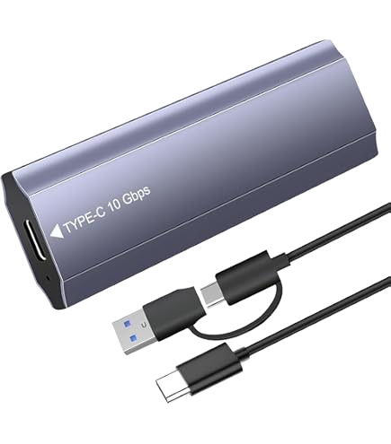
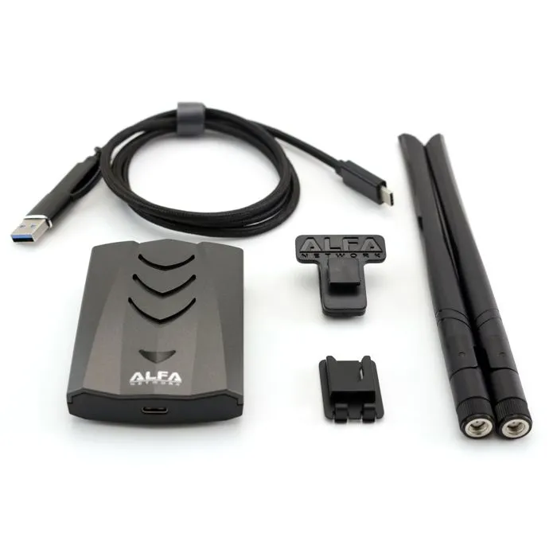

# Personal Home Lab — System Architecture

Dies ist meine persönliche Home-Lab-Umgebung, die aus Interesse an IT-Infrastruktur und Systemtechnik entstanden ist. Parallel zu meiner Ausbildung zum Fachinformatiker für Systemintegration (FISI) habe ich diese Testumgebung aufgebaut, um neue Technologien auszuprobieren und praktische Erfahrungen mit Virtualisierung, Netzwerken und IT-Sicherheit zu sammeln.

## Projektziel & Motivation

Das Hauptziel dieses Repositories ist es, praktische Erfahrungen in der Netzwerk- und Systemadministration zu sammeln und moderne Werkzeuge kennenzulernen. Anstatt nur Theorie zu lernen, dient dieses Home Lab als persönliches Testfeld, um bewährte Konzepte aus der IT-Praxis — wie VLAN-Segmentierung, 3-Tier Storage und strukturierte Rechtevergabe (z.B. IGDLA) — in einer überschaubaren Umgebung Schritt für Schritt auszuprobieren.

## Hardware & Virtualisierung

- **Hypervisor:** Geekom A8 Mini PC (AMD Ryzen 8000 Series, Proxmox VE, 32GB DDR5 RAM, Radeon 780M iGPU)
- **Netzwerk-Hardware:** 
  - MikroTik RB5009UG+S+IN (Router / Firewall / Inter-VLAN Routing)
  - TP-Link SG2008P (L2+ Managed PoE+ Switch)
  - TP-Link EAP610 (Wi-Fi 6 Access Point mit Multi-SSID)

### Hardware Setup Galerie

  <table border="0">
    <tr>
      <td align="center" colspan="4" style="padding: 10px;">
         
        <b>📷 Mein physikalisches Setup:</b> Geekom A8 (Proxmox Node), MikroTik RB5009, TP-Link Omada Switch & EAP610 AP
      </td>
    </tr>
    <tr>
      <td align="center" width="25%" style="padding: 8px;">
         
        <b>Geekom A8 Mini PC</b> Proxmox VE Server (32GB DDR5)
      </td>
      <td align="center" width="25%" style="padding: 8px;">
         
        <b>MikroTik RB5009</b> Router & Inter-VLAN Firewall
      </td>
      <td align="center" width="25%" style="padding: 8px;">
         
        <b>TP-Link SG2008P</b> L2+ Managed PoE+ Switch
      </td>
      <td align="center" width="25%" style="padding: 8px;">
         
        <b>TP-Link EAP610</b> Wi-Fi 6 Access Point
      </td>
    </tr>
  </table>

### Storage-Strategie (3-Tiering)
Um die Leistung zu optimieren und Ressourcen sinnvoll einzuteilen, ist der Speicher in drei Schichten unterteilt:
- **Tier 1 (Hot - `local-lvm`):** 1 TB NVMe M.2 SSD (Für Proxmox OS und aktive VM/LXC Root-Disks)
- **Tier 2 (Warm - `usb-ssd`):** 1 TB NVMe über 10 Gbps USB-C (Für VM-Backups, Docker-Volumes, große VM-Disks)
- **Tier 3 (Cold - `sd-storage`):** 128 GB MicroSD (A2/V30) (Für Log-Archive, ISO-Dateien, Templates, Test-Disks)

  <table border="0">
    <tr>
      <td align="center" width="50%" style="padding: 10px;">
         
        <b>Samsung 990 EVO Plus 1 TB NVMe SSD</b> Tier 2 Warm Storage (VM Backups, Docker Volumes)
      </td>
      <td align="center" width="50%" style="padding: 10px;">
         
        <b>USB-C 10 Gbps NVMe Gehäuse</b> Externe Anbindung für Tier 2 Storage
      </td>
    </tr>
  </table>

### Test-Hardware für WLAN & Sicherheit (VLAN 99 - Kali)

  <table border="0">
    <tr>
      <td align="center" style="padding: 10px;">
         
        <b>Alfa AWUS036ACH Dual-Band Wi-Fi Adapter</b> Paket-Analyse & WLAN-Sicherheitstests (Cisco Ethical Hacker Kurs)
      </td>
    </tr>
  </table>

## Netzwerk & VLAN Design

Das Netzwerk läuft hinter einem **Double NAT**, weshalb keine klassischen Portfreigaben möglich sind. Die einzelnen Bereiche sind durch passende VLAN-Regeln getrennt:

| VLAN | Name | Subnet | Tag | Verwendungszweck |
|---|---|---|---|---|
| **10** | Mgmt | `10.0.10.0/24` | Mgmt | Management-Netzwerk (Proxmox, Router, Switche, Pi-hole) |
| **21** | WinServer | `10.0.21.0/24` | WinS | Active Directory & Windows Server Lab |
| **22** | LinuxLab | `10.0.22.0/24` | LinS | Linux VMs/LXCs, Docker, AI Gateway & Proxy Dienste |
| **30** | Haus | `10.0.30.0/24` | HLab | Haupt-Heimnetzwerk (Zugriff auf AI Gateway erlaubt) |
| **40** | IoT | `10.0.40.0/24` | IoT | Isolierte Smart-Home & IoT-Geräte |
| **60** | Printer | `10.0.60.0/24` | Printer | Netzwerkdrucker |
| **99** | Kali | `10.0.99.0/24` | KLan | Penetration Testing & Sicherheits-Lab |

## 🗺️ Roadmap & Schritt-für-Schritt Verlauf

Das Home Lab wird schrittweise nach einem klaren Plan aufgebaut:

- [x] **Proxmox VE & Storage Tiering** (Grundinfrastruktur eingerichtet)
- [ ] ⏳ **Aktueller Schritt: Pi-hole (DNS & Werbeblocker)** (LXC Konfiguration)
- [ ] **Windows Server 2025 & Win11 VM** (VLAN 21 Setup)
- [ ] **Nginx Proxy Manager** (Reverse Proxy & SSL Zertifikate)
- [ ] **Tailscale Subnet Router** (Sicherer Fernzugriff)
- [ ] **Windows Active Directory & IGDLA** (Domänen-Einrichtung & Rechtestruktur)
- [ ] **OmniRoute AI Gateway** (Model-Routing)
- [ ] **Uptime Kuma & Statusübersicht**
- [ ] **Vaultwarden & Automatisches Backup**
- [ ] **Kali Linux Pentesting Lab** (VLAN 99)

## Praktische Entschlüsse & Ansätze

- **Bare-Metal-Hypervisor (Typ-1):** Proxmox VE ist als dedizierter Typ-1-Hypervisor direkt auf dem Mini-PC (Bare-Metal) installiert. Der Host dient als sauberes Fundament ausschließlich zur Verwaltung virtueller Ressourcen — Anwendungen werden nie direkt auf dem Proxmox-Host installiert.
- **LXC vs. Docker (Kombination):** Infrastrukturdienste (wie Tailscale, Pi-hole) laufen als eigene LXC-Kontainer für gute Stabilität. Weitere Anwendungen laufen in Docker innerhalb eines LXC.
- **Tailscale Fernzugriff:** Der VPN-Zugang ist in einem eigenen LXC installiert. So bleibt der Zugriff auf das Netzwerk auch dann erhalten, wenn andere Dienste getestet werden.
- **Windows Server Konzept (Geplant):** Im Windows Lab (VLAN 21) sollen Berechtigungen nach dem FISI-Standard **IGDLA** (Identities, Global groups, Domain Local groups, Access) konfiguriert werden, sobald die AD-Einrichtung erfolgt.
- **Lokale KI & GPU-Passthrough (Geplant):** Durch die direkte Durchreichung der Grafikkarte (iGPU-Passthrough auf Proxmox) soll ein open-source Sprachmodell (aktuell Qwen 2.5 7B) in einem eigenen LXC-Kontainer mit maximaler Leistung und Effizienz betrieben werden.
- **Webseiten-KI Entegrasyonu:** Einbindung des lokalen Modells über **Cloudflare Tunnel & Turnstile** — ermöglicht sichere KI-Antworten auf meiner Webseite, ohne Ports am Router zu öffnen.
- **DNS-Standard:** Es wird **`.mylab`** als lokale Top-Level-Domain genutzt.

---
*Dieser Bereich wird fortlaufend aktualisiert, sobald ein Schritt abgeschlossen ist.*
